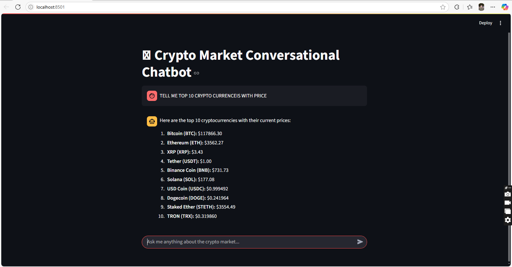

# 🪙 Crypto Market Conversational Chatbot OPEN AI AGENT SDK

This is a simple and interactive Streamlit-based chatbot that provides real-time cryptocurrency market data using conversational interface. The chatbot is built using the `agents` SDK and integrates tool calling for fetching live crypto stats such as:

- ✅ Total number of cryptocurrencies
- 💰 Global market cap
- 👑 Bitcoin dominance
- 📈 Live price summaries

---

## 🚀 Features

- 💬 Conversational UI with "You" and "Agent" messages
- 🔌 Tool calling via Gemini API or OpenAI-compatible endpoints
- 📊 Real-time crypto market summary using CoinGecko API
- ⚡️ Fast, lightweight, and user-friendly interface

---

## 🛠️ Tech Stack

- Python 🐍
- [Streamlit](https://streamlit.io/) for UI
- `agents` SDK by OpenAI for agent architecture
- CoinGecko API for market data

---

## 📸 Screenshot

 *(Add a screenshot of your chatbot if available)*

---

## 🧪 Run Locally

```bash
# 1. Activate your environment
source venv/bin/activate  # or `.\venv\Scripts\activate` on Windows

# 2. Install dependencies
pip install -r requirements.txt

# 3. Run the Streamlit app
streamlit run main.py
